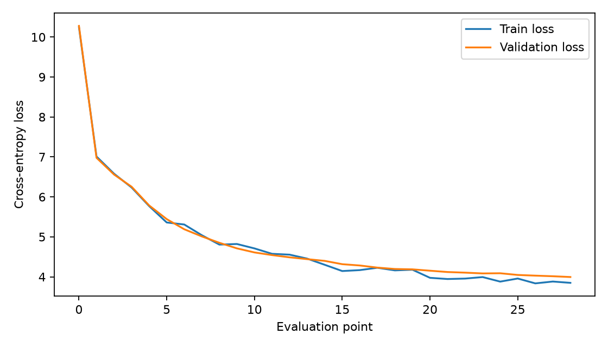
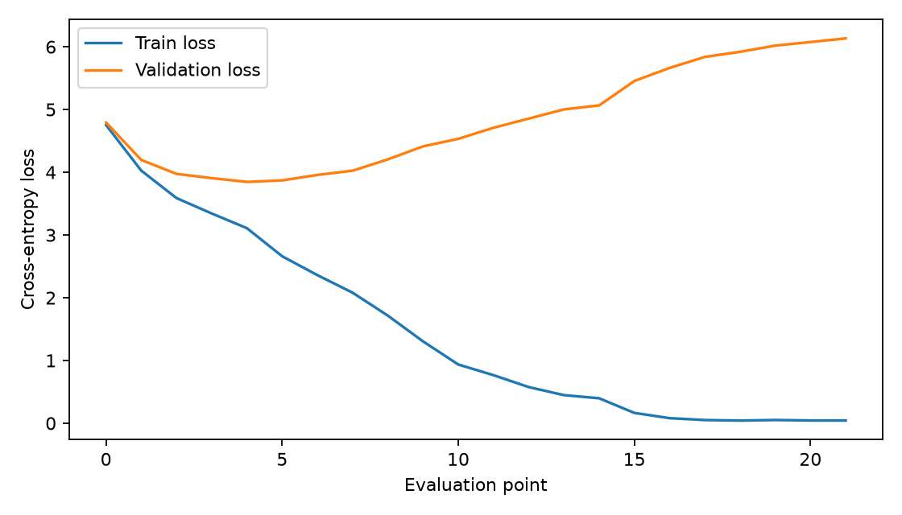

# Mahabharata GPT

Decoder-only Transformer language model trained from scratch on a self-curated Mahabharata/Sanskrit corpus using PyTorch.

This repository packages the training notebook into reusable Python modules, records the final 32M-parameter configuration, and includes experiment outputs and the trained checkpoint used for the final run.

## Highlights

| Item | Value |
|---|---:|
| Architecture | Decoder-only Transformer |
| Trainable parameters | ~32.1M |
| Vocabulary | 50,257 |
| Context length | 256 tokens |
| Embedding dimension | 256 |
| Transformer layers | 8 |
| Attention heads | 8 |
| Tokenizer | GPT-2 BPE |
| Framework | PyTorch |
| Training GPU | RTX 4090 / RunPod |
| Final train perplexity | 13.15 |
| Final validation perplexity | 21.26 |

## Repository Structure

```text
mahabharata-gpt/
├── configs/
│   └── 32m_config.json
├── src/
│   ├── dataset.py
│   ├── evaluate.py
│   ├── generate.py
│   ├── model.py
│   ├── tokenizer.py
│   └── train.py
├── checkpoints/
│   ├── README.md
│   └── mahabharata_30m_weights.pt
├── notebooks/
│   └── mahabharata_gpt_experiments.ipynb
├── results/
│   ├── gita_gpt_los.png
│   ├── gita_gpt_loss_overfit.png
│   ├── loss-plot.pdf
│   └── samples.txt
├── docs/
│   └── model_card.md
├── .gitattributes
├── .gitignore
├── requirements.txt
└── README.md
```

## Dataset

The model was trained on a self-curated Sanskrit/Mahabharata text corpus. The corpus was processed as a continuous token sequence using the GPT-2 BPE tokenizer and split into training and validation portions.

The training corpus itself is not included in this repository. Source text licensing should be reviewed before publishing any full corpus extracts.

## Architecture

The model follows a GPT-style causal language-modeling stack:

```text
Input tokens
  -> token embeddings + positional embeddings
  -> Transformer blocks x 8
      -> LayerNorm
      -> multi-head causal self-attention
      -> residual connection
      -> LayerNorm
      -> feed-forward network
      -> residual connection
  -> final LayerNorm
  -> linear language-model head
  -> next-token logits
```

The final run uses the configuration in [`configs/32m_config.json`](configs/32m_config.json).

## Training

Training uses next-token prediction with cross-entropy loss, AdamW optimization, gradient clipping, periodic train/validation evaluation, checkpoint saving, and autoregressive sample generation during training.

## Results

### Final Run

| Metric | Result |
|---|---:|
| Train loss | ~2.58 |
| Validation loss | ~3.05 |
| Train perplexity | 13.15 |
| Validation perplexity | 21.26 |

### Overfitting Experiment

The first small-corpus experiment strongly overfit:

| Metric | Result |
|---|---:|
| Training loss | ~0.04 |
| Validation loss | ~6.08 |

Scaling the corpus substantially improved validation behavior, showing the importance of dataset scale when training even a small decoder-only model from scratch.

## Loss Curves





The original PDF loss curve is also included at [`results/loss-plot.pdf`](results/loss-plot.pdf).

## Generation

The model supports autoregressive generation with temperature sampling, top-k filtering, configurable context length, and custom prompts.

Example outputs are saved in [`results/samples.txt`](results/samples.txt).

```text
Prompt: धर्म
Generated: धर्म, with austerities and self-control, learned in this world...
```

## Reproducibility

Install dependencies:

```bash
pip install -r requirements.txt
```

Train from a text file:

```bash
python src/train.py --data path/to/corpus.txt --config configs/32m_config.json
```

Generate from the included checkpoint:

```bash
python src/generate.py \
  --checkpoint checkpoints/mahabharata_30m_weights.pt \
  --prompt "धर्म"
```

Evaluate a checkpoint:

```bash
python src/evaluate.py \
  --checkpoint checkpoints/mahabharata_30m_weights.pt \
  --data path/to/corpus.txt
```

## Checkpoint

The final trained checkpoint is available at `checkpoints/mahabharata_30m_weights.pt` and is tracked using Git LFS because of its size.

After cloning the repository, install Git LFS and pull the large file:

```bash
git lfs install
git lfs pull
```

See [`checkpoints/README.md`](checkpoints/README.md) for checkpoint details and usage.

## Model Card

A compact model card describing intended use, training data, evaluation, limitations, and reproducibility is available at [`docs/model_card.md`](docs/model_card.md).

## Limitations

This is an educational/research-scale model trained on a relatively small domain-specific corpus. It is not intended to provide authoritative interpretations of the Mahabharata or Sanskrit texts. Generated text may be ungrammatical, repetitive, or hallucinated.

## Future Work

- Rotary positional embeddings
- Grouped-query or multi-query attention
- Longer context windows
- Larger model configurations
- Mixture-of-Experts variants
- Improved tokenization and evaluation benchmarks

## License

No project license is currently specified. Source-corpus licensing should be reviewed before publishing corpus extracts or choosing a final project license.
